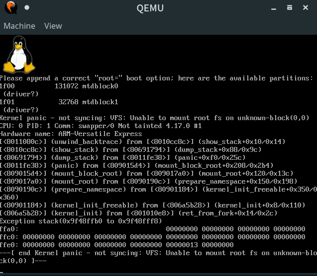

## 下载 Linux 最新版内核源码

[官方链接](https://cdn.kernel.org/pub/linux/kernel/v4.x/linux-4.17.tar.xz)

**解压 Linux 内核源码**

```shell
tar xaf linux-4.17.tar.xz 
```

## 实验环境

* ArchLinux amd64

### qemu

**qemu-system-arm**

```shell
yaourt -S qemu-arch-extra
```

### Arm toolchain

### gcc with gnu-eabihf

> 同时会安装 ==binutils== (汇编器和链接器, etc.) 还有 ==glibc== (C library 和 headers)的 `ARM` 版本


```shell
yaourt -S arm-linux-gnueabihf-gcc
```

> 提示 `未知的公共密匙 13FCEF89DD9E3C4F`
> 解决方法: gpg 导入公钥 ==gpg --recv-key 13FCEF89DD9E3C4F==

## 指定编译环境和目标架构

```shell
export ARCH=arm # 目标 arch
export CROSS_COMPILE=arm-linux-gnueabihf- # 使用的编译链 prefix
```

> 也可以直接写在 ==Makefile== 指定位置或者 ==make ARCH=arm CROSS_COMPILE=arm-linux-gnueabihf-== 来指定.

## Setting up kernel configuration

configuration 可以用于指定哪些内核驱动/模块打开或关闭.

==make defconfig== 创建默认配置, 不过我们一般需要更多的配置, 使用 ==make menuconfig== 交互式的创建自定义 config.

我们这里使用 ==make vexpress_defconfig== 创建默认配置.

## make

==make j8==

> 8 个核心全跑满, 大概 4 min

**编译好的 kernel 在 ==arch/arm/boot/zImage==

## qemu 运行一下

```
env LANG=en.US qemu-system-arm -M vexpress-a15 -m 512 -kernel arch/arm/boot/zImage -dtb arch/arm/boot/dts/vexpress-v2p-ca15-tc1.dtb -append "console=tty1"
```



## 下载编译 busybox

```shell
wget https://busybox.net/downloads/busybox-1.28.4.tar.bz2
tar xjf ./busybox-1.28.4.tar.bz2
```

**using default config**

```shell
cd busybox-1.21.1
make defconfig
make -j 8 install
```

> 将会安装到 ==_install== 目录

**添加一些重要的文件夹(作为 root dir)**

```shell
mkdir proc sys dev etc etc/init.d
```

## 参考

http://devarea.com/building-embedded-linux-system-with-qemu/#.WxoUmSRfhhE

https://github.com/surajx/qemu-arm-linux/wiki/Compile-Linux,-BusyBox-for-ARM-and-load-it-using-QEMU