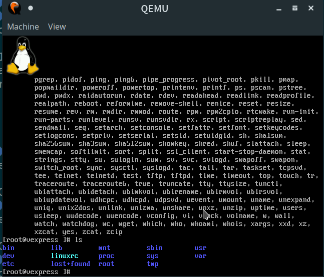

## 下载 Linux 最新版内核源码

[官方链接](https://cdn.kernel.org/pub/linux/kernel/v4.x/linux-4.17.tar.xz)

**解压 Linux 内核源码**

```bash?linenums
tar xaf linux-4.17.tar.xz 
```

## 实验环境

* ArchLinux amd64

### qemu

**qemu-system-arm**

```bash?linenums
$ yaourt -S qemu-arch-extra
```

### Arm toolchain

### arm gcc with gnu-eabihf

> 同时会安装 ==binutils== (汇编器和链接器, etc.) 还有 ==glibc== (C library 和 headers)的 `ARM` 版本


```bash?linenums
yaourt -S arm-linux-gnueabihf-gcc
```

> 提示 `未知的公共密匙 79BE3E4300411886`
> 解决方法: gpg 导入公钥 ==gpg --recv-key 79BE3E4300411886==

> 需要编译很多重量级软件, 大约 30min

## 指定编译环境和目标架构

```bash?linenums
export ARCH=arm # 目标 arch
export CROSS_COMPILE=arm-linux-gnueabihf- # 使用的编译链 prefix
```

> 也可以直接写在 ==Makefile== 指定位置或者 ==make ARCH=arm CROSS_COMPILE=arm-linux-gnueabihf-== 来指定.

## Setting up kernel configuration

configuration 可以用于指定哪些内核驱动/模块打开或关闭.

==make defconfig== 创建默认配置, 不过我们一般需要更多的配置, 使用 ==make menuconfig== 交互式的创建自定义 config.

我们这里使用 ==make vexpress_defconfig== 创建默认配置.

## make

==make -j 8==

> 8 个核心全跑满, 大概 4 min

**编译好的 kernel 在 ==arch/arm/boot/zImage==

> 编译出来的内核(压缩后)大小:

```bash?linenums
-rwxr-xr-x   1 kevin kevin 3.9M Jun  9 02:00 zImage
```

## qemu 运行一下

```
env LANG=en.US qemu-system-arm -M vexpress-a15 -m 512 -kernel arch/arm/boot/zImage -dtb arch/arm/boot/dts/vexpress-v2p-ca15-tc1.dtb -append "console=tty1" --nographic
```

> 指定 ==--nographic== 将会将内核输出在当前终端


一般运行结果为类似于以下 kernel 报错:

```
Please append a correct "root=" boot option; here are the available partitions:
1f00          131072 mtdblock0  (driver?)
1f01           32768 mtdblock1  (driver?)
Kernel panic - not syncing: VFS: Unable to mount root fs on unknown-block(0,0)
CPU: 0 PID: 1 Comm: swapper/0 Not tainted 4.4.0+ #5
Hardware name: ARM-Versatile Express
[<8001640c>] (unwind_backtrace) from [<80012f28>] (show_stack+0x10/0x14)
[<80012f28>] (show_stack) from [<8025978c>] (dump_stack+0x88/0x98)
[<8025978c>] (dump_stack) from [<800a4cd0>] (panic+0xa0/0x204)
[<800a4cd0>] (panic) from [<80646254>] (mount_block_root+0x1c0/0x25c)
[<80646254>] (mount_block_root) from [<8064640c>] (mount_root+0x11c/0x124)
[<8064640c>] (mount_root) from [<8064656c>] (prepare_namespace+0x158/0x19c)
[<8064656c>] (prepare_namespace) from [<80645ef0>] (kernel_init_freeable+0x268/0x278)
[<80645ef0>] (kernel_init_freeable) from [<804b8f44>] (kernel_init+0xc/0xe8)
[<804b8f44>] (kernel_init) from [<8000f538>] (ret_from_fork+0x14/0x3c)
```

## 下载编译 busybox

```bash?linenums
wget https://busybox.net/downloads/busybox-1.28.4.tar.bz2
tar xjf ./busybox-1.28.4.tar.bz2
```

**using default config**

```bash?linenums
cd busybox-1.21.1
make  ARCH=arm CROSS_COMPILE=arm-linux-gnueabihf- menuconfig
make  ARCH=arm CROSS_COMPILE=arm-linux-gnueabihf- -j 8 install
```

这里有一个重要的配置，因为 busybox 将被用作 init 程序，而且我们的磁盘镜像中没有任何其它库，所以 busybox 需要被静态编译成一个独立、无依赖的可执行文件，以免运行时发生链接错误。配置路径如下：

> Busybox Settings —>
> — Build Options
> [*] Build BusyBox as a static binary (no shared libs)

> 将会安装到 ==_install== 目录

**添加一些重要的文件夹(作为 root dir)**

> 注意这些文件的所有用户都是 ==root==

```bash?linenums
cd _install
mkdir proc sys dev etc etc/init.d var tmp mnt root
```

==/sbin/init== 一般是开机第一个被 kernel 运行的程序, 并且其默认的行为就是执行 == /etc/init.d/rcS== 中的内容.

> 这里用的是 busybox init, 嵌入式系统中经常使用, 但是主流发行版一般使用 ==systemd  init==

写入如下内容, 挂载目录 ==proc== 和 ==sysfs== 以及其他 init 操作

```bash?linenums
#!/bin/sh
PATH=/sbin:/bin:/usr/sbin:/usr/bin
mkdir -p /var/lock
mount -a # 由 ==/fstab== 指定
mkdir -p /dev/pts
mount -t devpts devpts /dev/pts
echo /sbin/mdev > /proc/sys/kernel/hotplug
mdev -s
ifconfig lo 127.0.0.1
/bin/hostname -F /etc/sysconfig/HOSTNAME
```

记得添加权限 ==chmod +x etc/init.d/rcS==

==rcS== 默认是被 ==/inittab== 指定的, ==inittab== 默认(也就是如果没有该文件的时候)是以下内容

```bash?linenums
# /etc/inittab
::sysinit:/etc/init.d/rcS
console::askfirst:-/bin/sh
::ctrlaltdel:/sbin/reboot
::shutdown:/bin/umount -a -r
::restart:/sbin/init
```
	
==/etc/profile== 指定一些基本的环境变量

```bash?linenums
LOGNAME=$USER
export HOSTNAME=`/bin/hostname`
export USER=root
export HOME=/root
export PS1="[$USER@$HOSTNAME \W]\# "
PATH=/bin:/sbin:/usr/bin:/usr/sbin
LD_LIBRARY_PATH=/lib:/usr/lib:$LD_LIBRARY_PATH
export PATH LD_LIBRARY_PATH
```

==/etc/sysconfig/HOSTNAME== 指定 hostname

```bash?linenums
dcmmc # 随便取
```

==/etc/fstab== 指定一些基本的设备挂载点

```bash?linenums
#device		mount-point	type	options		dump	fsck order
proc		/proc		proc	defaults		0	0
tmpfs		/tmp		tmpfs	defaults		0	0
sysfs		/sys		sysfs	defaults		0	0
tmpfs		/dev		tmpfs	defaults		0	0
var		/dev		tmpfs	defaults		0	0
ramfs		/dev		ramfs	defaults		0	0
debugfs		/sys/kernel/debug	debugfs		defaults	0	0
```

### 创建 ==/dev== 下的基本文件和创建 ==ext4 image file== (也可以用下面的打包成 rootfs.img)

```bash?linenums
#Copy shared libraries to rootfs
sudo cp -arf /usr/arm-linux-gnueabihf/lib/* rootfs/lib/
sudo rm rootfs/lib/*.a
sudo arm-linux-gnueabihf-strip rootfs/lib/*
 
#Create basic device nodes
sudo mkdir -p rootfs/dev/
sudo mknod rootfs/dev/tty1 c 4 1
sudo mknod rootfs/dev/tty2 c 4 2
sudo mknod rootfs/dev/tty3 c 4 3
sudo mknod rootfs/dev/tty4 c 4 4
sudo mknod rootfs/dev/console c 5 1
sudo mknod rootfs/dev/ttyAMA0 c 204 64
sudo mknod rootfs/dev/null c 1 3
 
#Create ext4 image file
dd if=/dev/zero of=a15rootfs.ext4 bs=1M count=$((32))
mkfs.ext4 a15rootfs.ext4
 
#Copy all the files in our rootfs to image
mkdir -p tmpfs
sudo mount -t ext4 a15rootfs.ext4 tmpfs/ -o loop
sudo cp -r rootfs/* tmpfs/
sudo umount tmpfs
```

> ==/usr/arm-linux-gnueabihf/lib/== 是 glibc-armhf 的位置, 可以是其他地方

> ==whoami== 提示 ==unknown uid 0 ==

编辑 ==/etc/passwd==

添加 ==root:x:0:0:root:/root:/bin/sh==

编辑 ==/etc/group ==

添加 ==root:x:0:root==

然后通过passwd给root设置密码(第一回需要通过图形的qemu输入命令)

> 提示 ==mmcblk0 Mounted root (ext4 filesystem) readonly==, ==mount -o rw== 提示没有开启 ==linux Large file support==

这是因为 ==a15rootfs.ext4== 没有开启 huge_file 支持

```bash?linenums
tune2fs -O ^huge_file ./a15rootfs.ext4
e2fsck ./a15rootfs.ext4
```

### 打包成 **rootfs.img**

先安装一下 ==cpio==

```bash?linenums
$ sudo pacman cpio
```

打包

```bash?linenums
 find . | cpio -o --format=newc > rootfs.img
 ```
 
 这样带有 ==busybox== 的 ==rootfs== 就打包好了.

## 使用磁盘镜像文件作为根文件系统

> 假定在 linux 源码目录下

创建 512M 的磁盘文件并格式化为 ==ext4==

```bash?linenums
qemu-img create -f raw disk.raw 512M
mkfs -t ext4 ./disk.raw
```

挂载到新文件夹 ==./img==

```bash?linenums
mkdir ./img
sudo mount -o loop ./disk.raw ./img
```

## 安装 Linux Kernel image 和 busybox 到虚拟磁盘

在 linux 源码目录下

```bash?linenums
sudo make ARCH=arm CROSS_COMPILE=arm-linux-gnueabihf- \
modules_install \ # 安装内核模块
INSTALL_MOD_PATH=./img  # 指定安装路径
```

在 busybox 源码目录下

```bash?linenums
$ sudo make CONFIG_PREFIX=<path_to_disk_img_mount_point> ARCH=arm CROSS_COMPILE=arm-linux-gnueabihf- -j 8 install
```

> 记得在挂载点也必须按照前面说的创建一些根目录下的文件夹以及 ==etc/init.d/rcS==

> 最终整个根目录大小:

```bash?linenums
[root@vexpress ]# du -sh
14.1M	.
[root@vexpress ]# 
[root@vexpress ]# uname -a
Linux vexpress 4.17.0 #3 SMP Sat Jun 9 02:00:02 CST 2018 armv7l GNU/Linux
[root@vexpress ]# 
```


 ## 运行 ==qemu== 模拟

```bash?linenums
env LANG=en.US qemu-system-arm -M vexpress-a15 -dtb arch/arm/boot/dts/vexpress-v2p-ca15-tc1.dtb -m 256M -kernel arch/arm/boot/zImage -drive format=raw,file=./a15rootfs.ext4,index=0,if=sd \
-append "root=/dev/mmcblk0 console=ttyAMA0 panic=0 rootfstype=ext4 rw" --nographic
```

> console 指定 tty1 或者其他 tty 都可以, 不过要想使用 ==--nographic== 必须是 ==ttyAMA0==

> 模拟的是 ARM-v7h A15 架构, 假设 ==disk.raw== 就在当前目录



## 参考

http://devarea.com/building-embedded-linux-system-with-qemu/#.WxoUmSRfhhE

https://github.com/surajx/qemu-arm-linux/wiki/Compile-Linux,-BusyBox-for-ARM-and-load-it-using-QEMU

https://hellogc.net/archives/121

https://medicineyeh.wordpress.com/2016/03/29/buildup-your-arm-image-for-qemu/

http://blog.163.com/awaken_ing/blog/static/12061319720127264411897