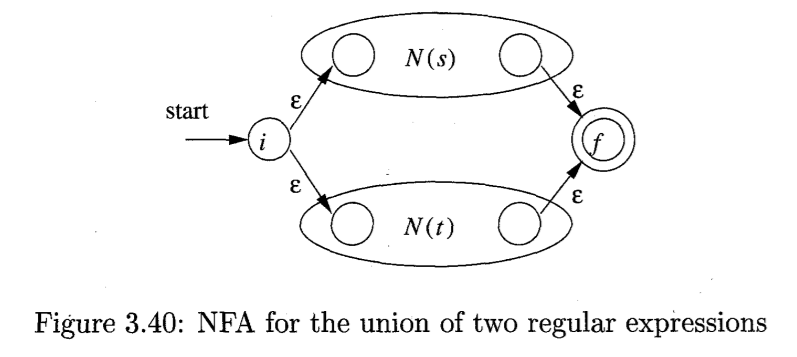

# 编译原理

## Reference

*Compilers - Principles Techniques and Tools 2nd*

## (p) 1. Compiler Intro.

**a skectch process of source code become executable file**

```mermaid!
graph TD;
	id[source files] --> preprocessor;
	preprocessor-- source codes -->id1(compiler);
	id1(compiler)-- assemble codes/intermediate code中间代码 -->assembler;
	assembler-- pure codes, i.e. multiple executable files -->id2[Linker/Loaders];
	style id1 fill:#f9f,stroke:#333,stroke-width:4px;
```

> source code to intermediate code is ==compiler front end==, intermediate code to executable file is ==compiler back-end==

e.g. clang use ==IR== as intermediate, all C-family languages(such as C, C++, Object-C) will compiler to ==IR==.

**More detials of compiler**

```mermaid!
graph TD;
	id0(source codes)-->id1(Lexical Analyzer);
	id1(Lexical Analyzer)-- tokens/lexeme词素 -->Parser;
	Parser-->id6(semantic analyzer, static checking);
	id6-- syntax tree -->id2(Intermediate code generator);
	id2--> id3(three-address code/四元式);
	id1---id4(Symbol table);
	Parser---id4;
	id2---id4;
	id6---id4;
	id3-- code optimal 机器有关/机器无关 --> id5(intermediate code);
```

> token/lexeme always represented as tuple '<token-type, attribute-value>'.

## (p) 1. Grammer

### **Chomsky hierarchy** of ==formal grammer==

符号约定:

* ==`!$V_T$`==: terminal state, 一般用小写字母, 数字或者符号表示
* ==`!$V_N$`==: non-terminal state, 一般用大写字母表示
* ==`!$V$`==: terminal or non-terminal state
* ==`!$\epsilon$`==: empty string
* 希腊字母(e.g. `!$\alpha$`) 用来表示非终结状态和终结状态组成的串

> 以下的文法符号表示都是用的正则基本符号(Kleene operator)

### **Type-0 grammer, i.e., Unrestricted grammar/recursively enumerable**

==`!$[V\epsilon]* \rightarrow [V\epsilon]*$`==

the Automaton is called ==Turing machine==

### **Type-1 grammer, i.e., Context-sensitive grammar**

==`!$\alpha V_N \beta \rightarrow \alpha (V*) \beta$`==

the Automaton is called ==Linear-bounded non-deterministic Turing machine==

> 其中 `!$\alpha$` 和 `!$\beta$` 都是 `!$[V\epsilon]*$`

### **Type-2 grammer, i.e., context-free grammer**

==`!$V_N \rightarrow [V\epsilon]*$`==

the Automaton is called ==Non-deterministic pushdown automaton==

> 在语法分析中普遍使用

> Type-2 grammer 有两种定义

如果由产生式 `!$A \rightarrow \alpha$` 则 `!$\beta = \lambda A \sigma \Rightarrow \lambda \alpha \sigma = \phi, \beta \Rightarrow \phi$`, `!$\phi$` 可以由 `!$\beta$` **直接推导** 出来。

若 `!$\alpha = v_0 \Rightarrow v_1 \Rightarrow \cdots \Rightarrow v_n = \beta$`, 则称 `!$\beta$` 可以由 `!$\alpha$` **推导** 出来。

**句型** 是由开始状态 `!$S$` 推导出来的（可能）含有非终结状态的串。

**句子** 是全部由终结状态组成的串。

从最左到右替换非终结符称为左推导，相反的就是最右推导， **最右推导** 又称 **规范推导**， 左推导和右推导所得句型分别称为 **左句型** 和 **右句型（规范句型）**

 > 不一定所有句型都有最右或最左推导。

**规约** 就是推导的逆过程， 规范规约也就是最左规约，每次规约的都是当前符号串的最左边部分。

设 `!$\alpha, \delta \in V^*, \beta \in V^+$` 是文法 `!$G[S]$` 的句型，若对于 `!$A \in V_N$` 有 `!$S \overset{*}{\Rightarrow} \alpha A \delta, A \overset{+}{\Rightarrow} \beta$` 则称 `!$\beta$` 是句型  `!$\alpha \beta \delta$`  相对于非终结符 A 的短语（如果 `!$A \Rightarrow \beta$` 则称直接短语）。

一个句型的最左直接短语称为此句型的 **句柄**。

### **Type-3 grammer, i.e., regular grammer**

右线性文法(right regular, 最常用)

==`!$V_N \rightarrow V_T V_N^+$`==

> 在词法分析中普遍使用

左线性文法(left regular, 左边跟右边的 `!$V_N$` 正好跟右线性文法相反)

==`!$V_N \rightarrow V_N^+ V_T$`==

the Automaton is called ==Finite state automaton== (DFA/NFA)

> Type-1 到 Type-3 都可以表示成一个 4-tuple: ==`!$(V, \Sigma, F, S, Z)$`==
> `!$V$` 是一个有限集合, 为所有非终结状态集, `!$\Sigma$` 为字母表(Vocabulary), `!$F$` 为 **产生式（Production）** 集合, `!$S$` 为开始状态(只有一个), `!$Z$` 为终结状态集合.

**等价性**

如果两个 Automaton 产生的所有串的集合(**Language, 语言， L(G)**)相同的话, 则称这两个 Automaton 等价, 所以有定理: **对于字母表 `!$\Sigma$` 上的任一 NFA `!$M$`, 必存在 `!$\Sigma$` 上与 M 等价的 DFA `!$M'$`**.

> 然而对于 **前后文无关文法(Type-2 grammer)** 等价问题是 **不可判定** 的.

### Derivations(推导)

就是从开始符号出发, 不断用产生式的右部替换左部的状态一直到终结符号(terminals), 就是一个文法推导出来的符号串(string), 所以可能推导出来的符号串（句子）的集合为 **语言(language)**.

**语法分析(Parsing)** 就是给定一串终结符, 找出如何从这个文法(**这里的文法指的是上下文无关文法, i.e., Type-2 grammer, 如果没有特殊说明, 在语法分析中所说的文法都是上下文无关文法** )的开始符号推导出该串.

### **语法分析树(Parse Tree)** 由文法推导出来的一个终结符号串生成(yield)

* 根为开始符号(状态)
* 叶子为 `!$\epsilon$` 或终结符号
* 中间结点(interior node) 为非终结状态
* 如果一个结点 `!$A$` 有多个连接的孩子结点 `!$\alpha_1 \alpha_2 \cdots \alpha_n$`, 其中 `!$\alpha$` 表示终结状态或非终结状态, 则这个产生式表示为 `!$A \rightarrow \alpha_1 \alpha_2 \cdots \alpha_n$`, 当然 `!$A \rightarrow \epsilon$` 亦是合法的.

> 一般推导都是从最左到右替换非终结符(也就是 **最左推导**）

**二义性(Ambiguity)**

一个文法的终结符号串可以通过不止一种语法树遍历出来.

> 一般需要使用没有二义性的文法或者对有二义性的文法添加限制规则来分析语法

在很多的编程语言中, 运算符(Operator)都会有自己的 **结合性(Associativity)** 和 **优先级(Precedence)**.

* 结合性常常表现为递归, 左结合一般表示为 **(直接)左递归(也就是产生式的右部的最左状态就是左部状态, e.g., `!$A \rightarrow A \alpha$`)**

> 含有递归的文法产生的语言是 **无限的**

* 低优先级的运算符的产生式推导出高优先级的运算符的产生式

结合性和优先级都会影响语法分析树的生成, 常常可以作为消除二义性的方法.

## 语法制导翻译（Syntax-Directed Translation)

一棵语法分析树的所有非叶子结点都标记上 **属性（attribute）** 来作为 **注释（annotation）** 进而形成一颗注释语法分析树。

**属性** 是与程序构造有关的量，一般是当前所在非终结状态的有关（翻译）信息（e.g., 表达式的数据类型，生成代码中的指令数目， etc.），并且要定义一套 **语义规则（semantic rule）** 计算产生式中的符号相关联的属性。属性很多时候是由孩子结点的属性规约而成的。

**翻译方案（translation scheme）** 就是在遍历这个注释树的时候如何翻译为程序片段，我们可以在产生式中嵌入语义动作（semantic action）来用于描述翻译结果（用来输出结果）。

## 语法分析（Parser）

> 虽然上下文无关文法的语法分析器一般都是 O(n^3) 的 time complexity， 不过通过设计高效的文法， 一般可以做到 linear time。

用语法分析结合之前加入的语义动作便可以完成翻译器的实现。

### 自顶向下（top-down）分析

输入指针（ 输入当前的非终结符号被称为向前看（look ahead）符号）指向输入串的第一个元素，语法分析树的箭头从标号为非终结结点的根结点开始， 从它的多个产生式中推导出符合该输入元素的生成式（中的对应终结符号， 并且是从产生式的最左边符号开始， **最左规约**）， 就是不断地去自顶向下从左往右试探，如果遇到不合适就 **回溯** ，再去尝试其他得产生式。

**预测分析法** 

是一种 **递归下降分析法（recursive-descent parsing， 文法的每一个非终结符号都有一个对应的过程，i.e., 无返回值函数）** 的简单形式。

> 所一个非终结符里面就对应一个过程，一个非终结符能推导出多个产生式的话，该非终结符对应的过程里面就会有 **switch-case** 结果来跳转到对应的产生式序列，产生式中的终结符用 **match** 过程表示，非终结符又会对应一个过程，就这样一直递归下去。


预测分析法必须要知道一个产生式体所有可能生成的串的第一个符号组成的集合（**FIRST 集**），这样才能在一个非终结符号能推导出多个产生式的时候用 **switch-case** 结构。也就是说所有产生式都必须直接或者能推导为以终结符号开头（i.e., 没有左递归），并且如果有 `!$A \rightarrow \alpha, A \rightarrow \beta$` 那么必须有 **FIRST（A）** 和 **FIRST（B）** 不相交（ `!$\epsilon$` 除外）

在没有其他产生式可用时， `!$\epsilon$`-产生式为默认选择（也就是什么也不做，空的过程）。e.g., 对于产生式：


一般 ==optexpr== 过程可描述为：


**消除(直接)左递归**

> 使直接左递归变成右递归

对于产生式 `!$A \rightarrow A \alpha | \beta$`

可以转化为：

```mathjax!
$
A \rightarrow \beta R \\
R \rightarrow \alpha R | \epsilon
$
```
> 左递归的消除必须在添加好语义动作之后进行

**翻译器的化简**

* 消除尾递归：可以将过程中调用的尾递归用 **while 循环** 替代（一般来说现代 gcc 和 javac 编译器都可以完成简单的消除尾递归）
* 合并过程，将简单的直接调用过程直接 inline 展开到过程中。


### 自底向上（bottom-up）分析

## (p) 2. Lexical Analyzer

> 成熟的词法分析生成器工具：jflex

> 词法分析一般会构造符号表给语法分析使用，并且对于嵌套作用域的语言来说，还需要用类似于栈的形式来新建和推出块作用域符号表。

词法分析使用正则表达式(Type-3 grammer), 并且需要构造出对应的 FA(有限自动机, DFA/NFA).

[正则表达式转自动机的算法](https://github.com/DCMMC/SimpleReg2Automata/blob/master/src/main/java/tk/dcmmc/Reg2Automata.java)

### construct `!$\epsilon$`-NFA from regex

使用 Dijkstra 双栈表达式求值算法, 构造出一个中缀表达式树或者直接一边执行表达式求值一边进行正则表达式操作构造, 使用图来保存自动机.

正则表达式运算符优先级(由高到低):

* ==(== left parentheses
* ==\*==(left-associative) 
* concatenation (left-associative)
* ==|== (left-associative) 
* ==)== right parentheses

Thompson 法




### construct DFA from `!$\epsilon$`-NFA

使用 **子集构造法(subset construction)**.

// TODO

### minimized-DFA

子集划分法

// TODO

## (p) 3. Parser

> 成熟的语法分析翻译方案构造器：Yacc

一个文法可能有多棵语法树生成同一给定的终结符号串, 这种文法被称为具有 **二义性(ambiguous)**, 必须要附加一些规则来 **消除二义性**.

> （抽象）语法树的全结点由终结符号构成，语法分析树的结点除了叶子结点为终结符号之外其他结点为非终结符号。

## (p) 4. Intermediate code generator